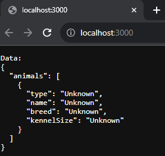

# Associate Software Developer Take-Home Exercise

This exercise is intended to assess your coding strategy and methodology through practical application. It is not meant to be overly difficult, and there is no one "correct" answer; it is meant as a launching point for discussion about your approach to solving problems through code.

## Setup

It is recommended to use Visual Studio Code as an environment, and the instructions will assume you do, but feel free to use any IDE that works for you.

1. Install [Visual Studio Code][VS Code download].
1. Install [Node.js][Node download].
1. In a terminal, run the command `npm i -g pnpm`.
   - If npm is not recognized as a command, you may need to restart your computer.
1. [Clone this GitHub repository][GitHub guide] to your local machine.
1. Open VS Code, and within it open the root folder of the GitHub repo.
1. From the extensions menu (Ctrl+Shift+X), install the workspace recommended extensions.
   - Note that some recommendations come from VS Code itself. These are not required.
   - If you already had VS Code and some extensions installed, you may not see any recommendations. In that case, you do not need to install any additional extensions.
1. Open a terminal in VS Code, and run `pnpm install`
   - If pnpm is not recognized as a command, you may need to restart your computer.
1. When that process is finished, from the Run and Debug menu, run "Launch Node and open in Chrome". This should be selected by default, and can also be run by pressing F5.
1. Verify the terminal reports that the server is running on port 3000, and that Chrome has opened and displays the following (color scheme may differ):

   

1. Try making a change to the output in "data-access/load-data.js" and refreshing the browser window. Verify that the change is reflected.

## Instructions

This project is a basic Node Express app that takes JSON data, and merges them together in a uniform way. The scenario is that you are preparing data from across multiple animal shelters that store their own data in different ways, and you need to standardize it for another program that would perform the analysis on all animals across the shelters. The program is incomplete, and contains a bug. The assignment has two parts, both within the file "load-data.js":

1. Write the function `mergeAndSortData`
   - It should transform each JSON object into the below format, merge them into an array, and sort them first by animal type (dog/cat) and then by kennel size. Any missing data should be the string "Unknown".
   - Format:
     ```json
     {
      "animals": [
        {
          "type": "dog/cat",
          "name": "string",
          "breed": "string",
          "kennelSize": "small/medium/large"
        }
      ]
     }
     ```
   - Feel free to add utility functions as needed
1. Find the bug in the existing function `transformPetSanctuary` and fix it.
   - There is also a secondary problem in the code related to this bug. For an extra challenge, find and fix this problem as well.


[VS Code download]: https://code.visualstudio.com/download
[Node download]: https://nodejs.org/en/download
[GitHub guide]: https://docs.github.com/en/repositories/creating-and-managing-repositories/cloning-a-repository